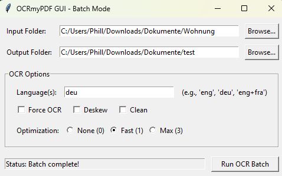

# Simple OCRmyPDF GUI

A straightforward graphical user interface (GUI) built with Python's Tkinter library to simplify the use of the powerful `ocrmypdf` command-line tool. This script allows you to easily apply OCR to PDF files in batch mode.



## Features

* **Batch Processing:** Select an input folder and process all contained PDF files.
* **Easy Folder Selection:** Browse buttons to choose input and output directories.
* **Customizable OCR Options:**
    * Specify language(s) for OCR (`--language`).
    * Option to force OCR even if text is present (`--force-ocr`).
    * Option to deskew pages before OCR (`--deskew`).
    * Option to clean pages (despeckle, remove borders) before OCR (`--clean`).
    * Select optimization level for output file size/quality (`--optimize`).
* **Simple Status Updates:** Basic feedback during processing via a status bar.
* **Completion Summary:** Reports the number of successful and failed files upon completion.

## Requirements

1.  **Python 3.x:** The script is written for Python 3.
2.  **Tkinter:** Usually included with standard Python installations. If not, you may need to install it separately (e.g., `sudo apt-get install python3-tk` on Debian/Ubuntu).
3.  **OCRmyPDF:** The core OCR engine. This GUI *requires* `ocrmypdf` to be installed and accessible in your system's PATH. Follow the official installation instructions for your operating system:
    * [OCRmyPDF Installation Guide](https://ocrmypdf.readthedocs.io/en/latest/installation.html)
4.  **Tesseract OCR:** `ocrmypdf` relies on Tesseract. Ensure it's installed as part of the `ocrmypdf` installation process.
5.  **Tesseract Language Packs:** You need the language packs for the languages you intend to recognize. Install them using your system's package manager (e.g., for English and German on Debian/Ubuntu: `sudo apt-get install tesseract-ocr-eng tesseract-ocr-deu`). Check the Tesseract documentation for package names on other systems.
6.  **Ghostscript:** Required by `ocrmypdf` for PDF processing. Usually installed as a dependency.

## Installation

1.  **Install `ocrmypdf` and its dependencies** (including Tesseract and Ghostscript) by following the [official OCRmyPDF Installation Guide](https://ocrmypdf.readthedocs.io/en/latest/installation.html).
2.  **Install required Tesseract language packs** (e.g., `tesseract-ocr-eng`, `tesseract-ocr-deu`).
3.  **Clone this repository or download the Python script** (`ocr_gui.py`).

## Usage

1.  Make sure all requirements listed above are installed correctly.
2.  Open a terminal or command prompt.
3.  Navigate to the directory where you saved the script.
4.  Run the script using Python:
    ```bash
    python ocr_gui.py
    ```
    *(Replace `ocr_gui.py` with the actual filename if you renamed it)*
5.  The GUI window will appear.
6.  Click "Browse..." next to "Input Folder" and select the directory containing the PDF files you want to process.
7.  Click "Browse..." next to "Output Folder" and select the directory where the processed OCR'd files should be saved.
8.  In the "Language(s)" field, enter the Tesseract language code(s) for your documents (e.g., `eng` for English, `deu` for German, `eng+fra` for English and French).
9.  Select the desired checkbox options:
    * **Force OCR:** Overwrites any existing text layer.
    * **Deskew:** Straightens crooked pages.
    * **Clean:** Removes speckles and dark borders.
10. Select the desired **Optimization** level (0=None, 1=Fast/Web, 3=Max/Print). Level 1 is a good default.
11. Click the "**Run OCR Batch**" button.
12. The status bar will show the progress (processing file X of Y). The terminal where you launched the script may also show detailed command output and errors.
13. Wait for the process to complete. A summary message box will appear.
14. Check your selected output folder for the processed files (usually named `*_ocr.pdf`).

## Options Explained

* **Language(s):** Corresponds to `ocrmypdf --language <LANG>`. Determines the language model(s) Tesseract uses for recognition. Use `+` to combine languages (e.g., `eng+deu`).
* **Force OCR:** Corresponds to `ocrmypdf --force-ocr`. Useful if a PDF has faulty or incomplete text you want to replace.
* **Deskew:** Corresponds to `ocrmypdf --deskew`. Rotates pages slightly to make text horizontal, improving OCR accuracy.
* **Clean:** Corresponds to `ocrmypdf --clean`. Uses `unpaper` or similar tools to remove noise and scanner artifacts before OCR.
* **Optimization:** Corresponds to `ocrmypdf --optimize <LEVEL>`. Controls post-processing optimization (0=none, 1=fast, 2=reserved, 3=best/max).
